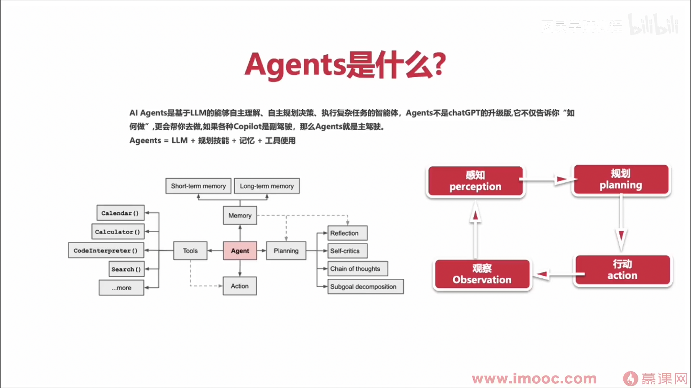

## Agent 介绍
### 1 Agents 是什么
Agents 是一种能够自主决策并执行任务的智能系统，通常用于处理复杂的任务或自动化工作流。
- 不需要为不同任务使用的单独的软件  超级助手
- 使用日常语言命令你的设备
- "代理"是人工智能的高级形式
- 未来五年将成为现实
- 人人都会有自己的私人助理Agents
- 各类行业应用 教育，科研，娱乐 ...
- 生产力的改变
- 继PC，IOS，安卓之后的下一个平台

**Agents=LLM+规划技能+记忆+工具使用**
 - 本质上 Agents是一个LLM的编排与执行系统
 - 一个精简的Agents决策流程，一个循环一个任务

### 2 Agents 的基本构成和常见类型
Agents 的基本构成包括：
- **感知模块**：用于接收外部输入。
- **决策模块**：基于输入和内部逻辑生成行动计划。
- **执行模块**：执行具体的任务或操作。

常见类型包括：
- **任务型 Agents**：专注于完成特定任务。
- **对话型 Agents**：用于自然语言交互。
- **多模态 Agents**：能够处理多种输入和输出形式。

### 3 如何实现 Agents 的记忆与工具使用
- **记忆**：通过存储上下文信息或历史记录，Agents 可以在任务中保持状态感知。
- **工具使用**：通过集成外部 API 或插件，Agents 可以扩展其功能，例如数据查询、计算或自动化操作。

### 4 Agents 开发的最佳实践与安全提示
- **最佳实践**：
  - 模块化设计，便于扩展和维护。
  - 使用测试驱动开发（TDD）确保功能可靠。
- **安全提示**：
  - 限制外部 API 的权限，防止滥用。
  - 实现输入验证，避免恶意输入。

### 5 开源脚手架一览
以下是一些常用的开源脚手架：
- **LangChain**：用于构建复杂的语言模型应用。
- **Haystack**：专注于问答系统和信息检索。
- **Rasa**：用于对话型 Agents 的开发。

### 6 LangSmith 与 LCEL 是什么，如何使用
- **LangSmith**：一种用于调试和监控语言模型应用的工具。
- **LCEL (LangChain Expression Language)**：一种专为 LangChain 设计的表达式语言，用于简化复杂任务的定义。

使用方法：
1. 安装相关依赖。
2. 配置环境并集成到项目中。
3. 根据文档使用其功能进行开发和调试。
